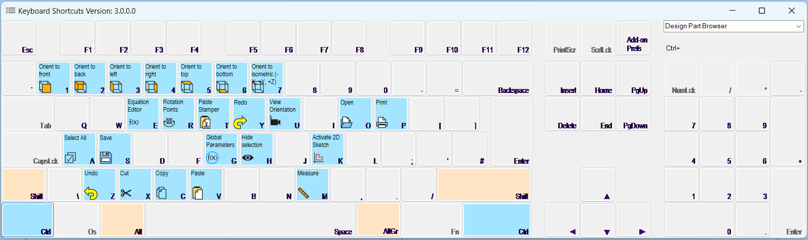

# AlibreShortcuts
 
An Add-on for Alibre V27 that displays keyboard shortcuts for any command in Alibre.
Version 3.0 added Alibre Icons to the Keyboard View and allows the user to set their own color preferences.

## Installation

1. Download the latest release from the [Releases](https://github.com/bolsover/AlibreShortcuts/releases) page.
2. Unzip the file to a folder of your choice.
3. Run the `AlibreShortcuts.exe` file.

## Usage

1. Open Alibre.
2. Click the `Shortcuts` icon in the Add-ins tab.
3. Click either the `Shortcuts` or `Keyboard` sub-menu .

## License and Copyright

This project is licensed under the MIT License - see the [LICENSE.md](LICENSE.md) file for details.

All content and branding related to Alibre, Alibre Design, and Alibre Script, including any third-party contributions, are governed by their respective licensing agreements and are the intellectual property of Alibre, LLC.

## Acknowledgments

* [Alibre](https://www.alibre.com/)
* [Alibre Forum](https://www.alibre.com/forum/index.php)
* All Alibre Forum members who have contributed dicussion leading to this Add-on. 
* Particularly @NateLiquidGravity for feedback and inspiration for the Keyboard layout. Also @Cator for providing the Icon and .svg files used.

## Screenshots

## Known Issues

1. The Shortcuts menu item is set to be shown 'Always'; that is it shows in all Alibre profiles: Sheet Metal, Part, Assembly, Drawing, Bill of Material etc. For some currently unknown reason selecting the menu items only works in the Part, Sheet Metal and Assembly profiles.

